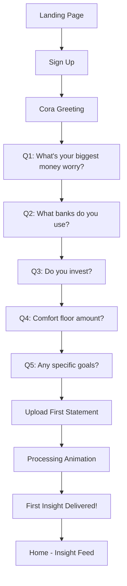
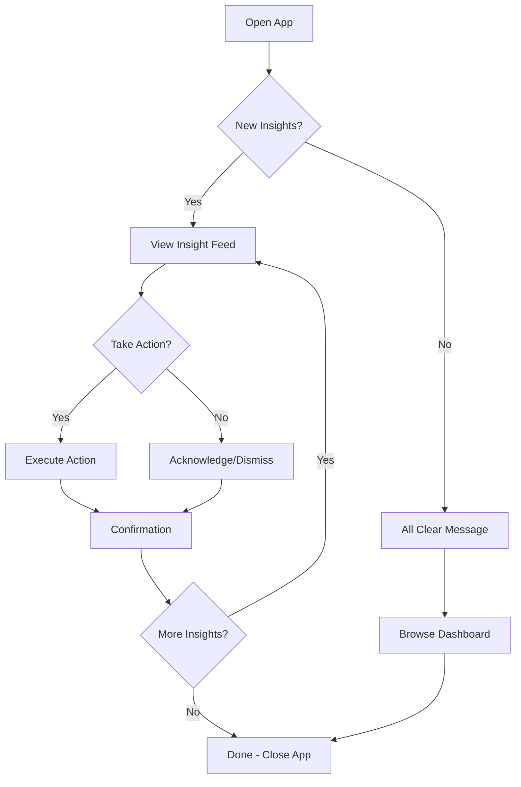
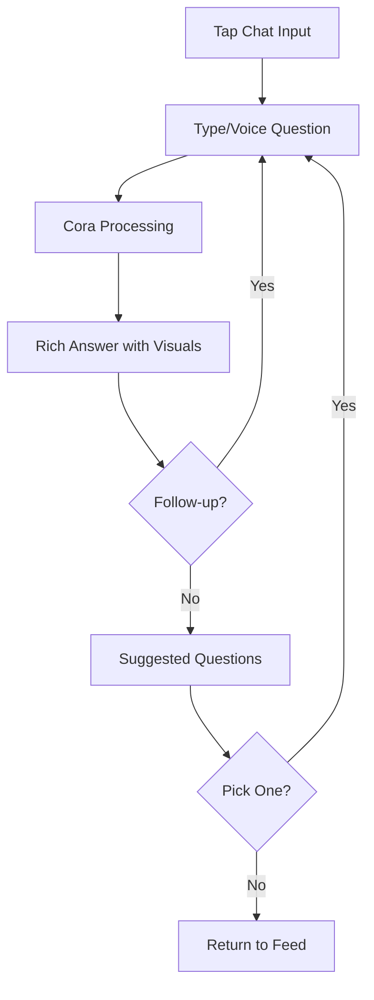
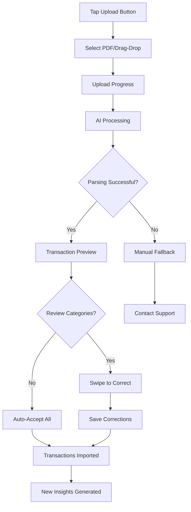
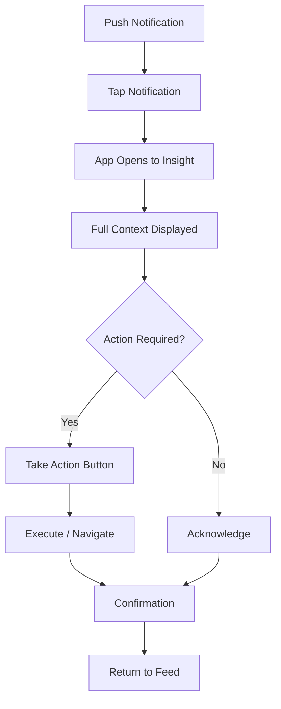

# Cora Finance UX Design Specification

_Created on 2025-11-27 by Ricar_
_Generated using BMad Method - Create UX Design Workflow v1.0_

---

## Executive Summary

**Cora Finance** is an AI-powered personal finance assistant built specifically for Portuguese tax residents. The product transforms the frustrating experience of managing personal finances into a calm, confident relationship with money.

### Core Vision
While US-centric apps like Mint and YNAB dominate globally, they fail to understand Portuguese tax law (IRS), local banking systems (Moey, ActivoBank, CGD), or EU investment brokers (XTB, Trading212, Degiro). Cora addresses this fundamental gap.

### The Insight
Most people don't budget because it's exhausting and boring. They rely on mental rules like "don't go below €X" while leaving significant money on the table through missed tax optimizations, suboptimal investments, and invisible recurring expenses. **Cora watches your money so you don't have to.**

### Target Users
Tech-savvy Portuguese professionals (25-45) who:
- Earn decent money but feel anxious about finances
- Have tried other apps but abandoned them as "too much work"
- Want to understand Portuguese tax implications (IRS)
- Use local banks (Moey, ActivoBank, CGD) and EU brokers (XTB, Trading212, Degiro)

### The Compelling Moment
Not "here's a pie chart of your spending" — but rather:
> **"You're leaving €847 on the table this year in IRS deductions you didn't claim."**

### Unique Value Proposition
- **Proactive, not reactive** — Cora comes to you with insights; you don't dig
- **Tax-aware** — Every financial decision is contextualized with Portuguese IRS implications
- **Personalized** — Learns your comfort floor, goals, worries, and risk tolerance
- **Educational** — Teaches WHY, not just WHAT, building financial literacy over time

### Desired Emotional Outcome
Transform **vague financial anxiety** into **calm confidence**.

---

## 1. Design System Foundation

### 1.1 Design System Choice

**Selected:** **shadcn/ui** with Tailwind CSS

#### Rationale

| Consideration | Why shadcn/ui |
|---------------|---------------|
| **Modern & Customizable** | Copy-paste components, not a dependency — full control over styling |
| **Tailwind-Based** | Utility-first CSS aligns with rapid iteration and responsive design needs |
| **Accessibility Built-In** | Based on Radix UI primitives with WCAG AA compliance |
| **React-Native** | Perfect for a modern PWA with complex state management |
| **Theming** | CSS variables make light/dark mode and brand customization trivial |
| **Community** | Rapidly growing ecosystem, well-documented, actively maintained |

#### What shadcn/ui Provides

- **40+ Components:** Buttons, forms, modals, cards, alerts, tooltips, etc.
- **Radix Primitives:** Accessible dialog, dropdown, tabs, accordion, etc.
- **Chart Components:** Recharts integration for financial visualizations
- **Form Handling:** React Hook Form + Zod validation patterns
- **Theming System:** CSS custom properties for complete brand control

#### Custom Components Needed

| Component | Why Custom |
|-----------|------------|
| **Insight Card** | Core proactive insight display — unique to Cora's model |
| **Financial Health Score** | Circular gauge with contextual color and explanation |
| **Transaction Row** | Swipeable (mobile) with quick categorization actions |
| **Chat Message** | Rich media support (charts, tables, lists) within bubbles |
| **Cora Avatar** | Animated presence indicator for AI personality |

#### Design Tokens Foundation

```css
/* Core spacing scale (4px base) */
--spacing-xs: 4px;
--spacing-sm: 8px;
--spacing-md: 16px;
--spacing-lg: 24px;
--spacing-xl: 32px;
--spacing-2xl: 48px;

/* Border radius */
--radius-sm: 4px;
--radius-md: 8px;
--radius-lg: 12px;
--radius-full: 9999px;

/* Shadows */
--shadow-sm: 0 1px 2px rgba(0,0,0,0.05);
--shadow-md: 0 4px 6px rgba(0,0,0,0.07);
--shadow-lg: 0 10px 15px rgba(0,0,0,0.1);
```

---

## 2. Core User Experience

### 2.1 Platform Strategy

**PWA — Cora is Everywhere**

| Platform | Primary Use Case | Experience |
|----------|------------------|------------|
| **Mobile** | Alerts on the go, quick check-ins | Push notifications, glanceable insights, quick acknowledgments |
| **Desktop** | Deeper financial review sessions | Rich visualizations, detailed analysis, statement uploads |
| **Both** | Seamless conversation continuity | Same Cora, same context, any device |

**Design Approach:** Mobile-first responsive design with progressive enhancement for desktop.

### 2.2 Core Interaction Model

**Fundamental Insight:** The user is *reactive*, Cora is *proactive*.

Traditional finance apps: User digs → App shows data → User interprets
**Cora's model:** Cora discovers → Cora delivers insight → User responds/acts

This is the key differentiator. Users don't come to Cora with questions most of the time — they open the app and **Cora tells them what matters.**

### 2.3 The Three User Actions

| Action | Description | Frequency |
|--------|-------------|-----------|
| **1. Respond to Cora** | Open app → See what Cora discovered → React/acknowledge/act | Daily/Weekly (primary) |
| **2. Ask Cora** | Natural language questions when curiosity strikes | On-demand |
| **3. Review & Correct** | Fix AI categorization, provide feedback | Occasional (training phase) |

### 2.4 What Must Be Effortless

1. **Getting instant clarity** — "Where did my money go?" → Immediate, visual, actionable answer
2. **Understanding recommendations** — WHY Cora suggests something, not just WHAT
3. **Acting on insights** — One tap to acknowledge, save, or take action

### 2.5 The Critical "Aha Moment"

**The Hook:** The first time Cora delivers an insight you didn't ask for.

Onboarding is tedious but necessary — you answer questions like an interrogation, but then it's over. The app must deliver value *after* that friction to keep users hooked.

**The "Aha Moment" happens when:**
- User opens app days after onboarding
- Cora says: "I noticed you're paying €12.99/month for a streaming service you haven't used in 3 months"
- User thinks: "Oh. THIS is different. Cora is actually watching."

**Design Implication:** The app must be designed around Cora's *proactive insights*, not user-initiated queries. The chat interface is secondary to the **insight feed**.

### 2.6 Defining Experience

**When someone describes Cora to a friend:**

> "It's the app that tells you what to do with your money — you don't have to figure it out yourself."

or

> "It's like having a financial advisor who actually pays attention to your accounts and messages you when something matters."

### 2.7 Novel UX Patterns

#### The Insight Feed (Primary Interface)

This is Cora's defining UX pattern — **not a chat, not a dashboard, but an insight feed**.

**Pattern Name:** Proactive Insight Feed

**User Goal:** See what matters without asking

**How It Works:**
1. User opens Cora
2. Sees a chronological feed of insights Cora has discovered
3. Each insight is actionable: acknowledge, save, dismiss, or drill down
4. Newest insights at top with visual priority indicators
5. Chat input at bottom for when user wants to ask

**Inspiration Sources:**
- **Slack/Teams:** Message-like flow with rich content
- **Apple Health:** Trends and insights surfaced proactively
- **Notion AI:** Contextual suggestions within content

**Anatomy of an Insight Card:**

```
┌─────────────────────────────────────────────┐
│ 🎯 [Priority Indicator]         [Timestamp] │
│                                             │
│ [Insight Title - Bold, Scannable]           │
│                                             │
│ [Context/Explanation - 1-2 sentences]       │
│                                             │
│ [Optional: Visual - Chart/Graph/List]       │
│                                             │
│ ┌─────────┐ ┌─────────┐ ┌─────────┐        │
│ │ Action1 │ │ Action2 │ │ Dismiss │        │
│ └─────────┘ └─────────┘ └─────────┘        │
└─────────────────────────────────────────────┘
```

**Insight Priority Levels:**

| Level | Visual | Example |
|-------|--------|---------|
| 🔴 **Urgent** | Red accent, top of feed | "You'll hit your comfort floor in 3 days" |
| 🟡 **Important** | Yellow accent | "Tax deadline in 2 weeks - action needed" |
| 🟢 **Opportunity** | Green accent | "You could save €120/year by switching X" |
| 🔵 **Informational** | Blue accent | "Your spending was 10% lower this month" |
| ⚪ **FYI** | Subtle gray | "New statement processed successfully" |

**States:**
- **New:** Unread indicator (dot/badge)
- **Read:** No indicator
- **Acted Upon:** Checkmark, slightly faded
- **Dismissed:** Removed from feed (stored in history)
- **Saved:** Bookmarked for later reference

#### The Conversational Onboarding

**Pattern Name:** Progressive Conversational Interview

**Challenge:** Onboarding is tedious but necessary for personalization.

**Solution:** Make it feel like a conversation, not a form.

**Flow:**
1. Cora greets warmly, explains what she needs to help
2. Questions appear one at a time in chat bubbles
3. User responds via quick-select buttons OR free text
4. Cora acknowledges and builds on answers
5. Progress indicator shows "5 of 8 questions"
6. User can skip and come back later

**Design Principles:**
- **No walls of forms** — one question at a time
- **Smart defaults** — pre-select likely answers based on context
- **Escape hatch** — "Skip for now, I'll ask later"
- **Personality** — Cora's responses feel warm, not robotic

#### Rich Chat Responses

**Pattern Name:** Embedded Visualizations in Chat

**Challenge:** Financial answers often need charts, tables, or comparisons.

**Solution:** Chat messages can contain rich interactive elements.

**Supported Rich Content:**
- 📊 **Charts:** Bar, line, pie embedded in message bubble
- 📋 **Tables:** Scrollable transaction lists
- 📈 **Comparisons:** Side-by-side scenarios
- ✅ **Checklists:** Multi-step guidance
- 🔗 **Deep Links:** Tap to navigate to detailed view

---

## 3. Visual Foundation

### 3.1 Color System

**Theme Direction:** "Calm Confidence" — Trust meets Approachability

#### Color Philosophy

Cora deals with money, anxiety, and trust. The visual language must:
- **Build Trust:** Financial apps need to feel secure and reliable
- **Reduce Anxiety:** Calm colors, not aggressive banking red
- **Feel Approachable:** Warm enough to feel like a friend, not a bank
- **Portuguese Context:** Subtle nod to Portuguese identity without cliché

#### Selected Palette: "Oceanic Trust"

Inspired by the Portuguese coast — deep blues of the Atlantic meeting the warm terracotta of Lisbon, with modern teal accents.

**Primary Colors:**

| Role | Color | Hex | Usage |
|------|-------|-----|-------|
| **Primary** | Deep Teal | `#0D9488` | Primary actions, links, active states |
| **Primary Hover** | Darker Teal | `#0F766E` | Hover states |
| **Primary Muted** | Light Teal | `#CCFBF1` | Backgrounds, subtle highlights |

**Semantic Colors:**

| Role | Color | Hex | Usage |
|------|-------|-----|-------|
| **Success** | Emerald | `#10B981` | Positive trends, savings, gains |
| **Warning** | Amber | `#F59E0B` | Attention needed, approaching limits |
| **Danger** | Rose | `#F43F5E` | Negative trends, overspending, errors |
| **Info** | Sky Blue | `#0EA5E9` | Neutral information, tips |

**Neutral Scale:**

| Role | Hex | Usage |
|------|-----|-------|
| **Background** | `#FAFAFA` | Main app background |
| **Surface** | `#FFFFFF` | Cards, modals, elevated surfaces |
| **Border** | `#E5E7EB` | Subtle dividers, card borders |
| **Text Primary** | `#111827` | Headlines, primary content |
| **Text Secondary** | `#6B7280` | Descriptions, timestamps |
| **Text Muted** | `#9CA3AF` | Placeholders, disabled |

**Financial Data Colors:**

| Type | Color | Hex |
|------|-------|-----|
| **Money In** | Green | `#22C55E` |
| **Money Out** | Slate | `#64748B` |
| **Savings** | Teal | `#14B8A6` |
| **Investments** | Indigo | `#6366F1` |
| **Debt** | Orange | `#F97316` |

#### Dark Mode

| Role | Light | Dark |
|------|-------|------|
| **Background** | `#FAFAFA` | `#0F172A` |
| **Surface** | `#FFFFFF` | `#1E293B` |
| **Border** | `#E5E7EB` | `#334155` |
| **Text Primary** | `#111827` | `#F8FAFC` |
| **Text Secondary** | `#6B7280` | `#94A3B8` |

### 3.2 Typography

**Font Stack:**

| Role | Font | Fallback |
|------|------|----------|
| **Headings** | Inter | system-ui, sans-serif |
| **Body** | Inter | system-ui, sans-serif |
| **Monospace** | JetBrains Mono | monospace |

**Type Scale:**

| Level | Size | Weight | Line Height | Usage |
|-------|------|--------|-------------|-------|
| **H1** | 32px | 700 | 1.2 | Page titles |
| **H2** | 24px | 600 | 1.3 | Section headers |
| **H3** | 20px | 600 | 1.4 | Card titles |
| **H4** | 16px | 600 | 1.5 | Subsections |
| **Body** | 16px | 400 | 1.6 | Primary content |
| **Body Small** | 14px | 400 | 1.5 | Secondary content |
| **Caption** | 12px | 400 | 1.4 | Timestamps, labels |
| **Money Large** | 32px | 700 | 1.1 | Financial totals |
| **Money Medium** | 20px | 600 | 1.2 | Transaction amounts |

### 3.3 Iconography

**Icon Library:** Lucide Icons (consistent with shadcn/ui)

**Custom Financial Icons:**
- Health Score gauge
- Portuguese flag for tax features
- Cora avatar/mascot

### 3.4 Spacing System

**Base Unit:** 4px

| Token | Value | Usage |
|-------|-------|-------|
| `space-1` | 4px | Tight spacing, icon gaps |
| `space-2` | 8px | Related elements |
| `space-3` | 12px | Form elements |
| `space-4` | 16px | Card padding |
| `space-6` | 24px | Section gaps |
| `space-8` | 32px | Major sections |
| `space-12` | 48px | Page margins |

**Interactive Visualizations:**

- Color Theme Explorer: [ux-color-themes.html](./ux-color-themes.html)

---

## 4. Design Direction

### 4.1 Chosen Design Approach

**Direction:** "Conversational Dashboard Hybrid"

A unique layout that prioritizes the **Insight Feed** while keeping key metrics glanceable.

#### Layout Structure

**Mobile (Primary):**
```
┌─────────────────────────────────┐
│ [Header: Cora + Health Score]  │
├─────────────────────────────────┤
│                                 │
│   [Insight Feed - Scrollable]  │
│                                 │
│   • Insight Card               │
│   • Insight Card               │
│   • Insight Card               │
│   ...                          │
│                                 │
├─────────────────────────────────┤
│ [Chat Input: "Ask Cora..."]    │
├─────────────────────────────────┤
│ [Bottom Nav: Home|Data|Goals]  │
└─────────────────────────────────┘
```

**Desktop (Enhanced):**
```
┌────────────────────────────────────────────────────────────┐
│ [Top Nav: Logo | Search | Notifications | Settings]       │
├──────────────────┬─────────────────────────────────────────┤
│                  │                                         │
│  [Left Sidebar]  │   [Main Content Area]                  │
│                  │                                         │
│  • Dashboard     │   ┌─────────────────────────────────┐  │
│  • Transactions  │   │ [Insight Feed or Active View]   │  │
│  • Investments   │   │                                 │  │
│  • Debts         │   │                                 │  │
│  • Goals         │   │                                 │  │
│  • Tax Center    │   │                                 │  │
│  • Settings      │   └─────────────────────────────────┘  │
│                  │                                         │
│  ───────────────│   [Chat Panel - Collapsible Right]     │
│                  │                                         │
│  [Health Score]  │                                         │
│  [Quick Stats]   │                                         │
│                  │                                         │
└──────────────────┴─────────────────────────────────────────┘
```

#### Design Decisions

| Decision | Choice | Rationale |
|----------|--------|-----------|
| **Navigation** | Bottom nav (mobile), Sidebar (desktop) | Thumb-friendly mobile, comprehensive desktop |
| **Density** | Balanced — spacious cards, efficient lists | Finance needs breathing room but data density |
| **Visual Weight** | Light with subtle shadows | Calm, not overwhelming |
| **Content Flow** | Feed-based, chronological | Matches mental model of "what's new" |
| **Primary Action** | Floating chat input | Always accessible, never buried |

#### Key Screen Types

**1. Home / Insight Feed**
- Health Score prominently displayed
- Chronological insight cards
- Quick stats strip (Net worth, This month spending, Comfort floor status)
- Chat input always visible

**2. Dashboard Deep Dive**
- Spending breakdown charts
- Category drill-downs
- Time period toggles
- Transaction list with filters

**3. Conversation View**
- Full chat interface
- Rich message bubbles
- Suggested questions
- Context-aware quick actions

**4. Data Management**
- Account list with sync status
- Statement upload area
- Transaction review queue
- Categorization corrections

**5. Goals & Planning**
- Goal progress cards
- What-if simulators
- FIRE calculator
- Savings projections

**6. Tax Center (Portugal-Specific)**
- Tax calendar
- Deduction tracker
- IRS deadline alerts
- Tax optimization opportunities

**Interactive Mockups:**

- Design Direction Showcase: [ux-design-directions.html](./ux-design-directions.html)

---

## 5. User Journey Flows

### 5.1 Critical User Paths

#### Journey 1: First-Time User Onboarding

**Goal:** Get user from signup to first insight with minimal friction.

**Approach:** Progressive conversational interview with immediate value preview.



**Key Moments:**
- **Greeting:** Warm, explains what Cora does in 1 sentence
- **Questions:** One at a time, quick-select + free text option
- **Statement Upload:** Drag-drop with clear progress
- **First Insight:** WOW moment — Cora immediately finds something

**Escape Hatches:**
- Skip any question ("I'll ask later")
- Skip statement upload ("Explore first")
- Resume onboarding anytime

---

#### Journey 2: Weekly Check-In (Primary Usage)

**Goal:** User opens app → sees what matters → feels informed → closes app.

**Approach:** Insight-first, action-optional.



**Design Principles:**
- **< 30 seconds** to consume all new insights
- **One tap** to acknowledge/dismiss
- **Clear empty state** when nothing new

---

#### Journey 3: Ask Cora a Question

**Goal:** User has curiosity → asks in natural language → gets answer.

**Approach:** Chat interface with rich responses.



**Example Questions & Responses:**
- "Where did my money go last month?" → Spending breakdown chart + category list
- "Can I afford a €500 purchase?" → Cash flow analysis + comfort floor impact
- "How am I doing on taxes?" → Deduction summary + upcoming deadlines

---

#### Journey 4: Statement Upload & Review

**Goal:** Get transaction data into Cora with minimal effort.

**Approach:** AI-first with human review for edge cases.



**UX Details:**
- **Preview:** Show sample transactions before full import
- **Confidence:** Show AI confidence per category, highlight low-confidence items
- **Batch Correction:** "Apply to all similar" option
- **Learning:** "Cora will remember this" confirmation

---

#### Journey 5: Respond to Urgent Alert

**Goal:** Time-sensitive insight gets user attention and action.

**Approach:** Push notification → Deep link → Immediate context.



**Alert Types & Actions:**
| Alert | Action |
|-------|--------|
| Approaching comfort floor | View forecast, adjust spending |
| Unusual transaction | Confirm or flag as fraud |
| Tax deadline | View details, mark complete |
| Subscription detected | Cancel link, keep tracking |
| Investment opportunity | Learn more, compare options |

---

## 6. Component Library

### 6.1 Component Strategy

#### From shadcn/ui (Customized)

| Component | Customization |
|-----------|---------------|
| **Button** | Primary teal, semantic variants, loading states |
| **Card** | Financial data styling, insight card base |
| **Dialog/Modal** | Confirmation flows, detail views |
| **Input** | Currency formatting, chat input styling |
| **Select** | Category picker, time period selector |
| **Tabs** | Dashboard sections, time toggles |
| **Toast** | Success/error feedback |
| **Avatar** | User profile, Cora avatar |
| **Badge** | Transaction categories, status indicators |
| **Progress** | Upload progress, goal progress |
| **Skeleton** | Loading states throughout |
| **Sheet** | Mobile slide-up panels |
| **Command** | Quick search, command palette |

#### Custom Components

**1. InsightCard**

The core component of Cora's proactive interface.

```typescript
interface InsightCardProps {
  id: string;
  priority: 'urgent' | 'important' | 'opportunity' | 'info' | 'fyi';
  title: string;
  description: string;
  timestamp: Date;
  isRead: boolean;
  visualization?: React.ReactNode; // Chart, table, etc.
  actions: InsightAction[];
  onDismiss: () => void;
  onAction: (actionId: string) => void;
}
```

**States:**
- Default (unread) — Bold title, priority indicator dot
- Read — Normal weight, no dot
- Expanded — Shows full visualization
- Acting — Loading state on action buttons
- Dismissed — Slide out animation

---

**2. HealthScoreGauge**

Circular gauge showing 0-100 financial health score.

```typescript
interface HealthScoreGaugeProps {
  score: number; // 0-100
  previousScore?: number; // For trend indicator
  size: 'sm' | 'md' | 'lg';
  showLabel: boolean;
  onTap?: () => void; // Drill down to explanation
}
```

**Visual Logic:**
- 0-40: Red zone (Danger)
- 41-60: Yellow zone (Caution)
- 61-80: Light green (Good)
- 81-100: Deep green (Excellent)

---

**3. TransactionRow**

Swipeable transaction item for lists and review queues.

```typescript
interface TransactionRowProps {
  transaction: Transaction;
  showCategory: boolean;
  showConfidence?: boolean; // AI categorization confidence
  onSwipeLeft?: () => void; // Quick action 1
  onSwipeRight?: () => void; // Quick action 2
  onTap: () => void; // View details
  onCategoryChange: (category: Category) => void;
}
```

**Mobile Gestures:**
- Swipe right: Approve/Confirm
- Swipe left: Edit category
- Tap: View details
- Long press: Multi-select

---

**4. ChatMessage**

Rich message bubble supporting embedded visualizations.

```typescript
interface ChatMessageProps {
  id: string;
  sender: 'user' | 'cora';
  content: string;
  richContent?: RichContent; // Chart, table, list, etc.
  timestamp: Date;
  status?: 'sending' | 'sent' | 'error';
  suggestedFollowups?: string[];
}
```

**Rich Content Types:**
- `chart`: Embedded Recharts visualization
- `table`: Scrollable data table
- `list`: Transaction or category list
- `comparison`: Side-by-side scenarios
- `action-buttons`: Inline action options

---

**5. CoraAvatar**

Animated avatar representing Cora's presence.

```typescript
interface CoraAvatarProps {
  size: 'sm' | 'md' | 'lg';
  state: 'idle' | 'thinking' | 'speaking' | 'celebrating';
  onClick?: () => void;
}
```

**Animation States:**
- Idle: Subtle breathing/pulse
- Thinking: Animated dots or gentle motion
- Speaking: Mouth/wave animation during response
- Celebrating: Confetti/sparkle for achievements

---

**6. MoneyDisplay**

Consistent currency formatting component.

```typescript
interface MoneyDisplayProps {
  amount: number;
  currency?: 'EUR' | string;
  showSign?: boolean; // +/- for gains/losses
  size: 'sm' | 'md' | 'lg' | 'xl';
  trend?: 'up' | 'down' | 'neutral';
  previousAmount?: number; // For comparison
}
```

---

**7. CategoryBadge**

Visual indicator for transaction/spending categories.

```typescript
interface CategoryBadgeProps {
  category: Category;
  size: 'sm' | 'md';
  showIcon: boolean;
  onClick?: () => void;
}
```

**Category Colors:** Each category has a distinct, accessible color.

---

**8. QuickStatCard**

Glanceable metric display for dashboard strips.

```typescript
interface QuickStatCardProps {
  label: string;
  value: string | number;
  trend?: 'up' | 'down' | 'neutral';
  trendValue?: string;
  icon?: React.ReactNode;
  onClick?: () => void;
}
```

---

## 7. UX Pattern Decisions

### 7.1 Consistency Rules

These patterns ensure users experience predictable, learnable interactions throughout Cora.

#### Button Hierarchy

| Level | Style | Usage |
|-------|-------|-------|
| **Primary** | Solid teal, white text | Main action per screen (1 max) |
| **Secondary** | Outlined teal, teal text | Alternative actions |
| **Ghost** | Text only, teal | Tertiary actions, links |
| **Destructive** | Solid rose, white text | Delete, cancel subscription |
| **Muted** | Gray background | Dismiss, close |

#### Feedback Patterns

| Type | Pattern | Duration | Position |
|------|---------|----------|----------|
| **Success** | Toast with checkmark | 3 seconds auto-dismiss | Bottom center (mobile), Top right (desktop) |
| **Error** | Toast with X, stays until dismissed | Manual dismiss | Bottom center (mobile), Top right (desktop) |
| **Warning** | Inline banner | Persistent until resolved | Above affected content |
| **Info** | Toast or inline | 4 seconds auto-dismiss | Context-dependent |
| **Loading** | Skeleton screens | Until loaded | In-place replacement |

#### Form Patterns

| Aspect | Decision | Rationale |
|--------|----------|-----------|
| **Label Position** | Above input | Clearer scanning, mobile-friendly |
| **Required Indicator** | Asterisk (*) after label | Standard, accessible |
| **Validation Timing** | On blur + on submit | Immediate feedback without interruption |
| **Error Display** | Inline below input, red text | Clear association |
| **Help Text** | Gray caption below input | Non-intrusive guidance |
| **Currency Input** | Right-aligned, € suffix | Financial convention |

#### Modal Patterns

| Type | Behavior | Use Case |
|------|----------|----------|
| **Alert Dialog** | Centered, overlay, requires action | Destructive confirmations |
| **Sheet (Mobile)** | Slides up from bottom | Quick actions, details |
| **Drawer (Desktop)** | Slides from right | Extended forms, detail views |
| **Full Screen (Mobile)** | Takes over viewport | Complex flows, onboarding |

**Dismiss Behavior:**
- Click outside: Close non-critical modals
- Escape key: Always closes
- Explicit close button: Always present
- Swipe down (sheets): Close on mobile

#### Navigation Patterns

| Pattern | Implementation |
|---------|----------------|
| **Active State** | Bold text + teal accent bar/dot |
| **Breadcrumbs** | Desktop only, for deep navigation |
| **Back Button** | App back (not browser) for internal flows |
| **Deep Linking** | All major views have shareable URLs |
| **Tab Memory** | Remember last tab in each section |

#### Empty States

| State | Message | Action |
|-------|---------|--------|
| **No Insights** | "All caught up! 🎉 Cora will notify you when something needs attention." | Browse dashboard link |
| **No Transactions** | "No transactions yet. Upload a statement to get started." | Upload button |
| **No Search Results** | "No matches found. Try different keywords." | Clear search link |
| **First Use** | Warm welcome + clear next step | Start onboarding CTA |

#### Confirmation Patterns

| Action | Confirmation | Undo Option |
|--------|--------------|-------------|
| **Delete Transaction** | Inline confirm button | 5-second undo toast |
| **Delete Account** | Full modal + type confirmation | None (irreversible) |
| **Dismiss Insight** | None (instant) | Undo toast |
| **Category Change** | None (instant) | Undo toast |
| **Unsaved Changes** | "Discard changes?" dialog | Cancel option |

#### Notification Patterns

| Type | Push | In-App | Email |
|------|------|--------|-------|
| **Urgent Alert** | ✅ Immediate | ✅ Badge + top of feed | Optional |
| **Important Insight** | ✅ Batched daily | ✅ In feed | No |
| **Opportunity** | Optional | ✅ In feed | No |
| **Weekly Summary** | No | ✅ In feed | Optional |
| **System Updates** | No | ✅ Quiet | Yes |

**Notification Preferences:**
- User can enable/disable push per category
- Quiet hours setting
- Digest frequency (instant, daily, weekly)

#### Search Patterns

| Aspect | Decision |
|--------|----------|
| **Trigger** | Tap search icon or use keyboard shortcut (⌘K) |
| **Behavior** | Instant search-as-you-type |
| **Scope** | Transactions, insights, help articles |
| **Filters** | Date range, category, amount range |
| **Recent** | Show recent searches on focus |

#### Date/Time Patterns

| Context | Format |
|---------|--------|
| **< 24 hours** | "2 hours ago", "Just now" |
| **< 7 days** | "Tuesday at 14:30" |
| **Same year** | "15 Mar" |
| **Different year** | "15 Mar 2024" |
| **Precise** | "15/03/2025 14:30" (PT format) |

**Timezone:** Always user's local timezone (detected or set in preferences).

---

## 8. Responsive Design & Accessibility

### 8.1 Responsive Strategy

#### Breakpoints

| Name | Range | Layout |
|------|-------|--------|
| **Mobile** | < 640px | Single column, bottom nav, sheets |
| **Tablet** | 640px - 1024px | Two column possible, side nav |
| **Desktop** | > 1024px | Multi-column, sidebar, split views |

#### Adaptation Patterns

| Element | Mobile | Tablet | Desktop |
|---------|--------|--------|---------|
| **Navigation** | Bottom tab bar (5 items max) | Collapsible sidebar | Persistent sidebar |
| **Insight Cards** | Full width, stacked | 2-column grid option | 2-3 column grid |
| **Charts** | Simplified, swipe to scroll | Full featured | Full featured + tooltips |
| **Tables** | Card view or horizontal scroll | Full table | Full table with sorting |
| **Chat Panel** | Full screen mode | Slide-over | Side panel (30% width) |
| **Modals** | Full screen sheets | Centered modals | Centered modals |
| **Forms** | Single column | Two column option | Two column |

#### Touch Targets

- **Minimum size:** 44x44px (Apple HIG)
- **Recommended:** 48x48px for primary actions
- **Spacing:** 8px minimum between touch targets

#### Mobile-First Considerations

1. **Performance:** Lazy load charts, paginate transactions
2. **Gestures:** Swipe-to-action on lists, pull-to-refresh
3. **Thumb Zone:** Primary actions in bottom 1/3 of screen
4. **Offline:** Cache last viewed data, queue actions

### 8.2 Accessibility Strategy

#### WCAG 2.1 AA Compliance

| Requirement | Implementation |
|-------------|----------------|
| **Color Contrast** | 4.5:1 minimum for text, 3:1 for large text |
| **Focus Indicators** | Visible focus ring on all interactive elements |
| **Keyboard Navigation** | Full functionality without mouse |
| **Screen Readers** | Semantic HTML, ARIA labels, live regions |
| **Motion** | Respect `prefers-reduced-motion` |
| **Text Sizing** | Scales with browser font settings up to 200% |

#### Color Accessibility

- **Never rely on color alone** — Always pair with icons/text
- **Semantic colors tested** for deuteranopia, protanopia, tritanopia
- **High contrast mode** support

#### Keyboard Navigation

| Key | Action |
|-----|--------|
| **Tab** | Move between interactive elements |
| **Enter/Space** | Activate buttons, links |
| **Escape** | Close modals, cancel |
| **Arrow keys** | Navigate lists, carousels |
| **⌘K / Ctrl+K** | Open command palette |

#### Screen Reader Support

- **Landmarks:** header, nav, main, aside, footer
- **Headings:** Proper hierarchy (h1 → h2 → h3)
- **Labels:** All form inputs labeled
- **Alt Text:** Meaningful descriptions for images/charts
- **Live Regions:** Announce toast notifications, loading states
- **Skip Links:** Skip to main content

#### Financial Data Accessibility

| Element | Consideration |
|---------|---------------|
| **Charts** | Provide data table alternative |
| **Money Values** | Read as "45 euros and 30 cents" |
| **Percentages** | Include context ("increased by 10%") |
| **Colors** | Red/green → also use ↑↓ arrows and labels |

### 8.3 Internationalization (Future-Ready)

| Aspect | Approach |
|--------|----------|
| **Language** | Portuguese (PT-PT) primary, English secondary |
| **RTL Support** | Not needed initially (PT, EN are LTR) |
| **Currency** | EUR default, formatted per locale |
| **Dates** | DD/MM/YYYY for PT, configurable |
| **Numbers** | 1.234,56 (European format) |
| **Content** | All strings externalized for translation |

---

## 9. Implementation Guidance

### 9.1 Development Priorities

#### Phase 1: Core Experience (MVP)

| Priority | Component/Feature | Notes |
|----------|-------------------|-------|
| 1 | Authentication flow | Sign up, login, password reset |
| 2 | Onboarding conversation | Progressive interview UI |
| 3 | Statement upload + processing | Drag-drop, progress, preview |
| 4 | Transaction list + categorization | Review queue, swipe actions |
| 5 | Insight Feed | Core proactive interface |
| 6 | Health Score gauge | Dashboard centerpiece |
| 7 | Basic chat interface | Natural language input, rich responses |
| 8 | Mobile responsive shell | Bottom nav, core layouts |

#### Phase 2: Enhanced Features

| Priority | Component/Feature | Notes |
|----------|-------------------|-------|
| 9 | Push notifications | Web push infrastructure |
| 10 | Dashboard deep dives | Spending charts, drill-downs |
| 11 | Tax center | Portugal-specific features |
| 12 | Desktop layout | Sidebar, split views |
| 13 | Goal tracking | Savings goals, progress visualization |
| 14 | Investment portfolio view | Unified broker display |

### 9.2 Technical Recommendations

#### Frontend Stack

| Layer | Recommendation |
|-------|----------------|
| **Framework** | Next.js 14+ (App Router) |
| **Styling** | Tailwind CSS + shadcn/ui |
| **State** | Zustand or React Query |
| **Forms** | React Hook Form + Zod |
| **Charts** | Recharts (shadcn/ui compatible) |
| **Animations** | Framer Motion |
| **Icons** | Lucide Icons |

#### Key Technical Decisions

| Decision | Rationale |
|----------|-----------|
| **Server Components** | Faster initial load, better SEO |
| **Streaming** | Progressive rendering for AI responses |
| **Optimistic Updates** | Instant feedback for actions |
| **PWA Service Worker** | Offline support, push notifications |
| **CSS Variables** | Easy theming, dark mode |

### 9.3 Quality Checklist

Before shipping any screen:

- [ ] Works on mobile (375px width)
- [ ] Works on desktop (1440px width)
- [ ] Keyboard navigable
- [ ] Screen reader tested
- [ ] Loading states implemented
- [ ] Error states implemented
- [ ] Empty states implemented
- [ ] Dark mode verified
- [ ] Color contrast checked
- [ ] Touch targets adequate (44px+)
- [ ] Performance budget met (< 3s load)

### 9.4 Completion Summary

**What We Created:**

| Deliverable | Status |
|-------------|--------|
| **Design System** | shadcn/ui with 8 custom components |
| **Color System** | "Oceanic Trust" palette — calming, trustworthy |
| **Typography** | Inter font family with financial-optimized scale |
| **Layout Direction** | Conversational Dashboard Hybrid |
| **Novel Pattern** | Proactive Insight Feed (Cora's core UX) |
| **User Journeys** | 5 critical flows mapped with decision points |
| **UX Patterns** | Complete consistency rules for all interactions |
| **Responsive** | Mobile-first with desktop enhancement |
| **Accessibility** | WCAG 2.1 AA compliance plan |

**Core Design Principles Established:**

1. **Cora is proactive, user is reactive** — Insight feed > Chat
2. **Calm confidence** — Trust colors, spacious layouts, no overwhelm
3. **One tap to value** — Minimal friction on all actions
4. **Portugal-first** — Tax features as first-class citizens
5. **Learn as you go** — Onboarding is tedious once, then never again

---

## Appendix

### Related Documents

- Product Requirements: `docs/prd.md`
- Product Brief: `docs/product-brief-cora-finance-2025-11-27.md`

### Core Interactive Deliverables

This UX Design Specification was created through visual collaboration:

- **Color Theme Visualizer**: docs/ux-color-themes.html
- **Design Direction Mockups**: docs/ux-design-directions.html

### Version History

| Date       | Version | Changes                         | Author |
| ---------- | ------- | ------------------------------- | ------ |
| 2025-11-27 | 1.0     | Initial UX Design Specification | Ricar  |

---

_This UX Design Specification was created through collaborative design facilitation, not template generation. All decisions were made with user input and are documented with rationale._
